# Capturi de ecran — aplicația iOS

Generate automat de workflow-ul iOS pentru commit-ul `60c31d8` (2026-10-01 08:08 UTC).

### menu

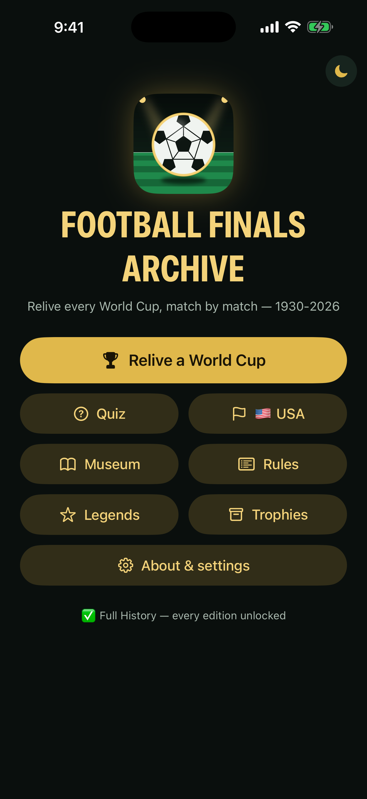

### editions

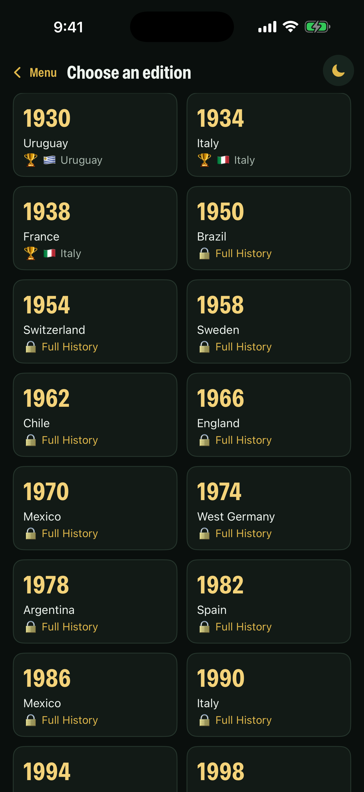

### teams

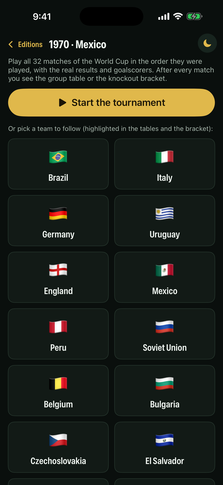

### run

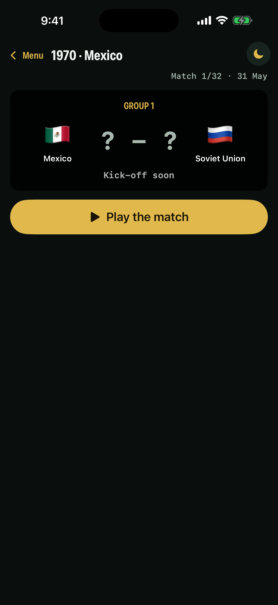

### runLive

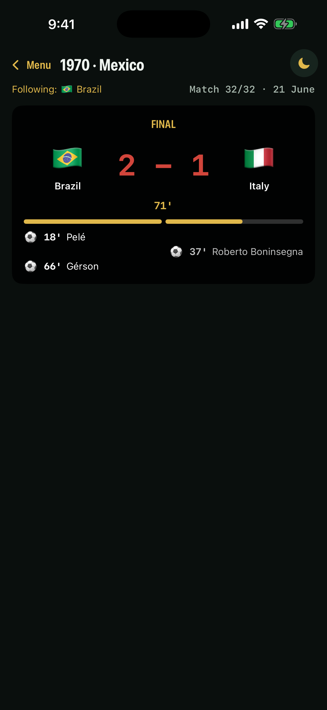

### runTogether

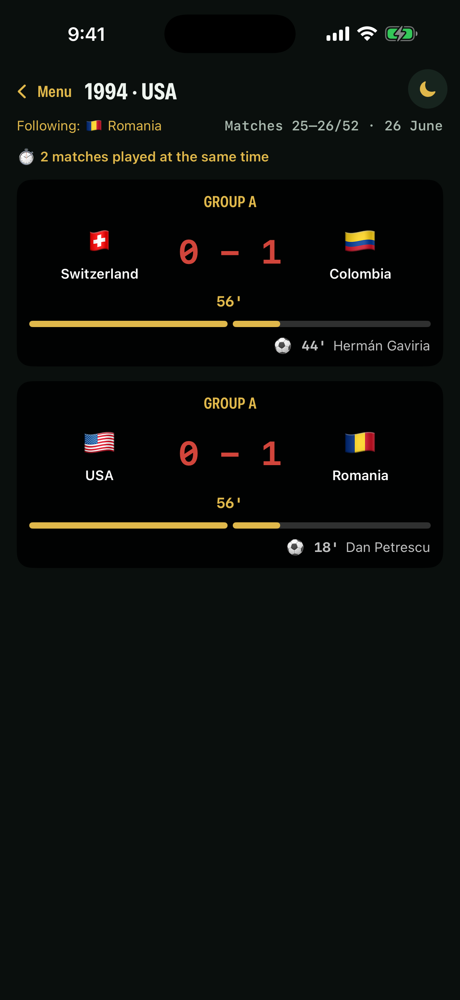

### runExtra

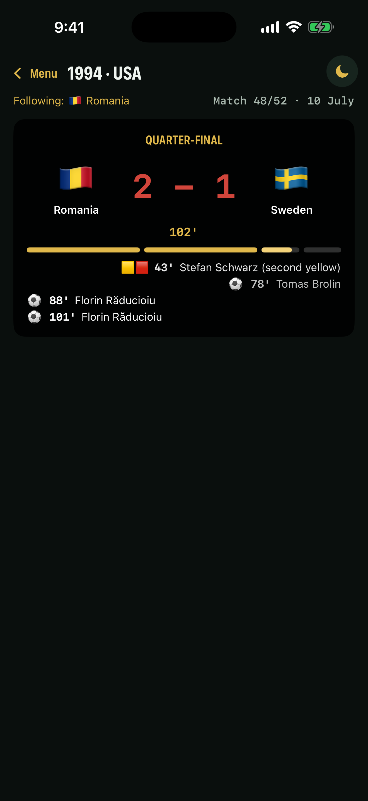

### runQuiz

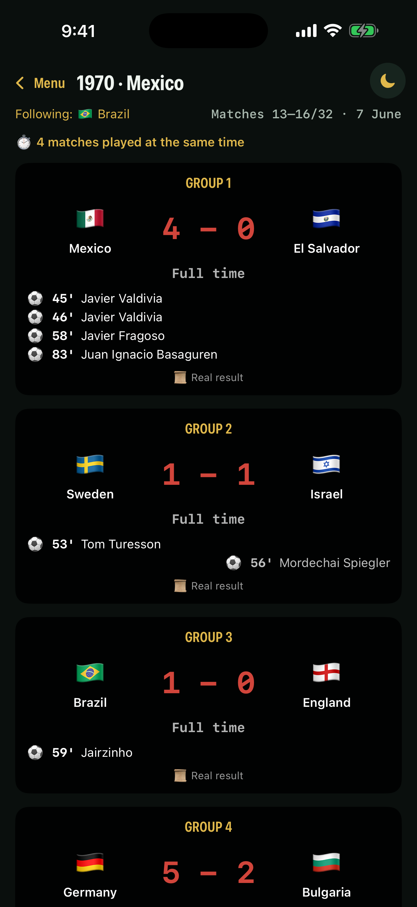

### runBracket

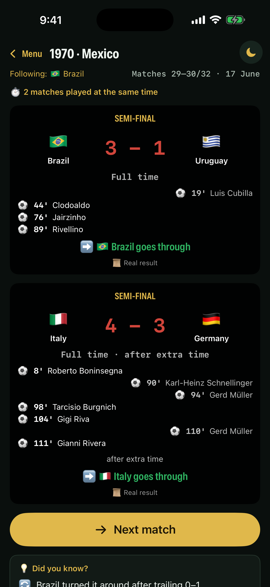

### runShootout

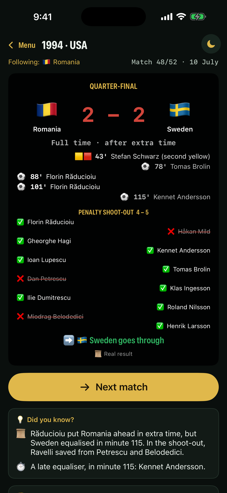

### runFinal

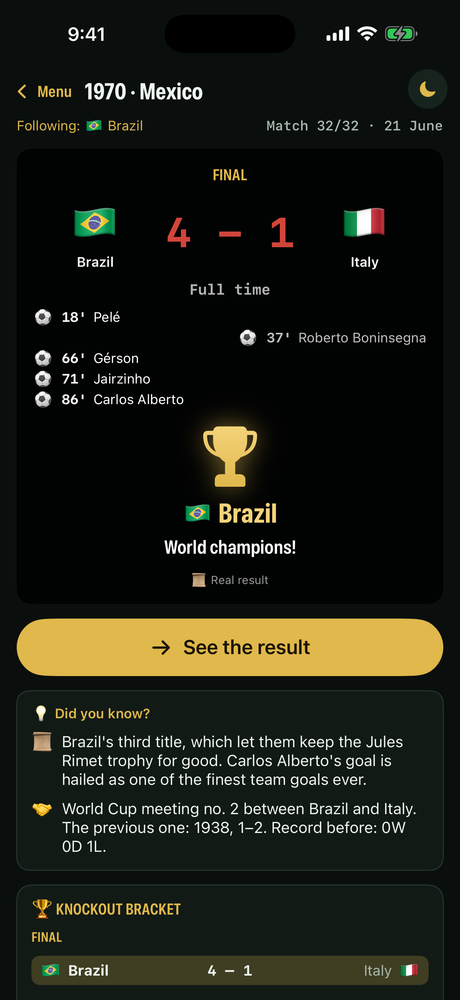

### runSummary

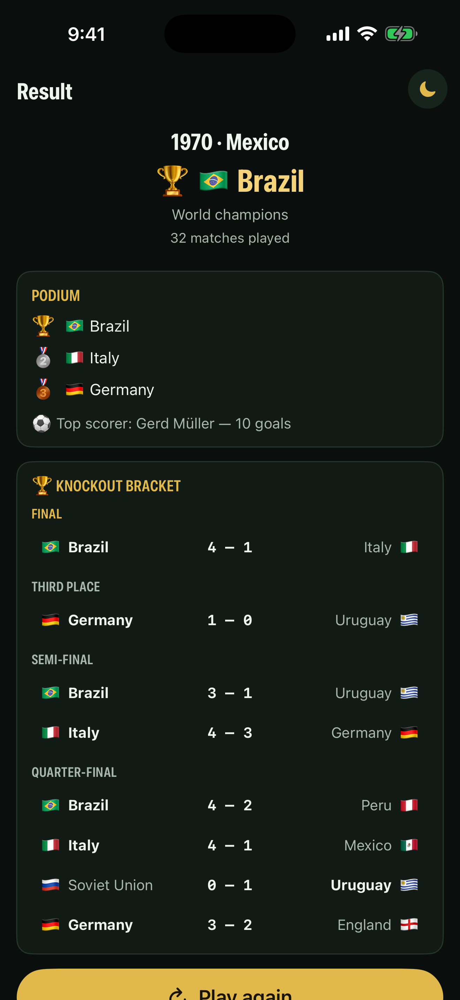

### museum

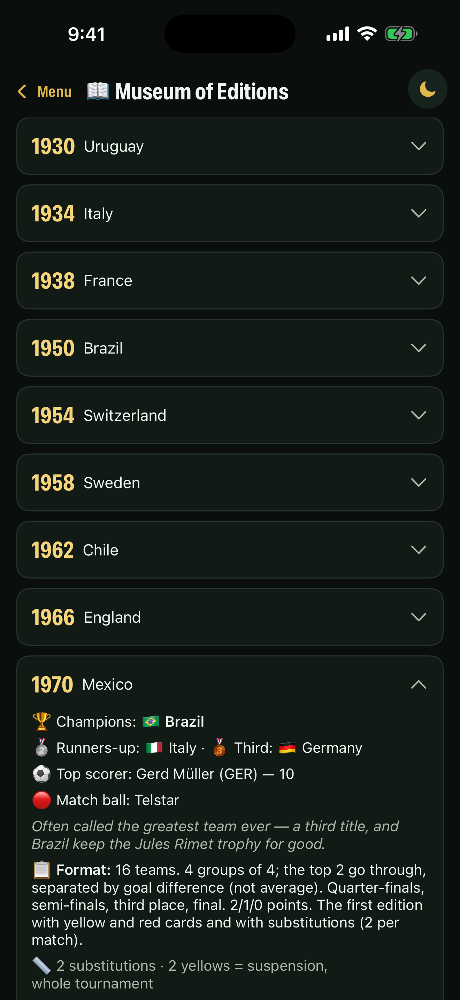

### legends

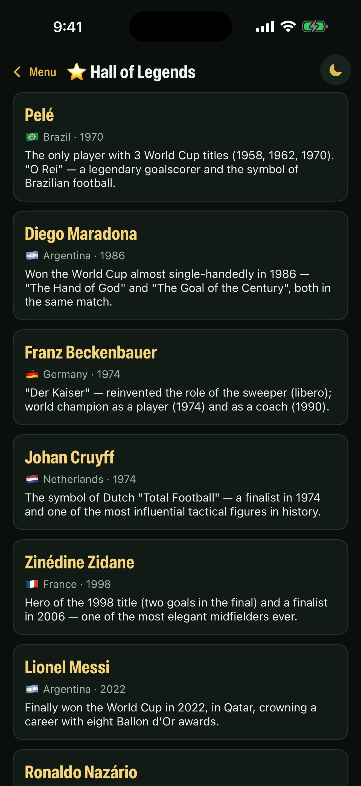

### trophies

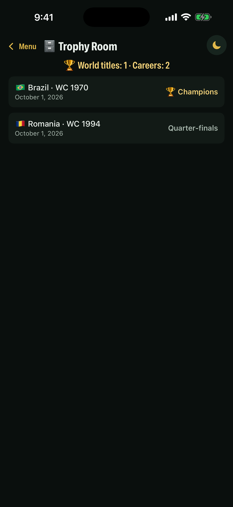

### rules

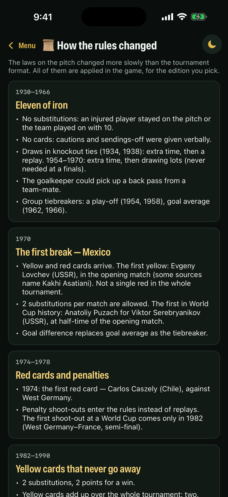

### quizMenu

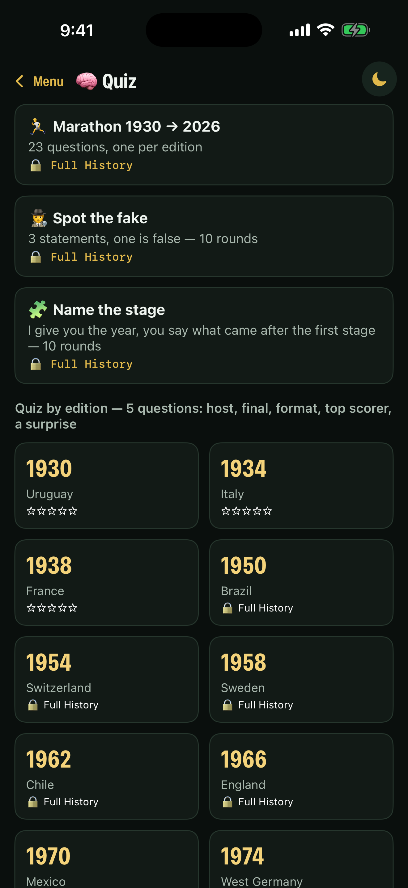

### quiz

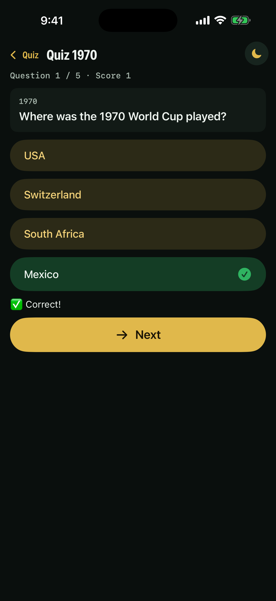

### country

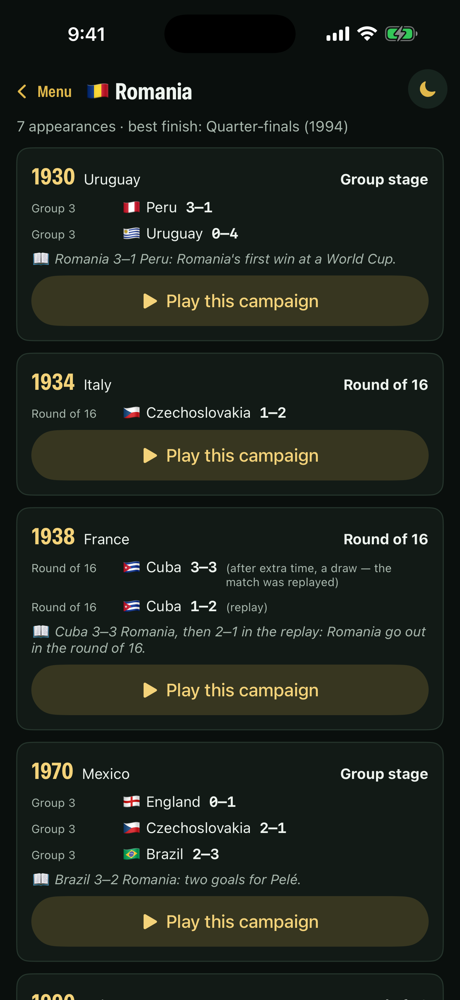

### paywall

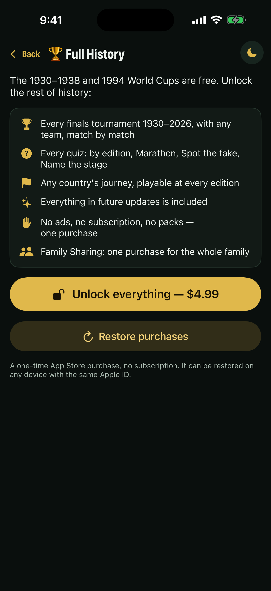

### about

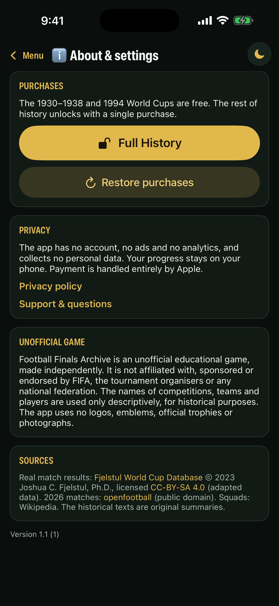

